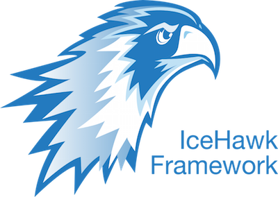

[](https://travis-ci.org/fortuneglobe/icehawk)
[](https://coveralls.io/github/fortuneglobe/icehawk?branch=master)
[](https://packagist.org/packages/fortuneglobe/icehawk) 
[](https://packagist.org/packages/fortuneglobe/icehawk) 
[](https://packagist.org/packages/fortuneglobe/icehawk) 
[](https://packagist.org/packages/fortuneglobe/icehawk)

# 

Fast and reliable PHP frontend framework respecting CQRS.

## Requirements

 * PHP >= 5.5
 * [fileinfo extension](https://pecl.php.net/package/Fileinfo) for handling uploaded files correctly
 * [xdebug extension](https://pecl.php.net/package/Xdebug) for running the tests

## Installation

Add this to your `composer.json`:

```json
"require": {
    "fortuneglobe/icehawk": "~1.4.0"
}
```

To run the tests, you should add this to your `composer.json` too:

```json
"require-dev": {
    "ext-xdebug": "*"
}
```

## Getting started

[We provide a seperate github-repository with documentation, usage and config examples.](https://github.com/fortuneglobe/icehawk-examples)
 
## Contributing

Please see our [contribution guide](./CONTRIBUTING.md).
